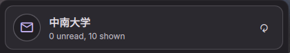

# Mail Reader for DankMaterialShell

An IMAP mail reader plugin for [DankMaterialShell](https://github.com/AvengeMedia/DankMaterialShell) with built-in email content viewer. Read your emails directly inside the shell without opening a separate mail client.

Forked from [Rocho's mailChecker](https://github.com/Rocho-EL-Locho/dms-mail-checker) with significant enhancements.



## Features

- **Bar indicator** with unread mail count
- **Popout message list** with sender, subject, and relative time
- **Built-in email content viewer** — click any message to read its full content (Subject, From, To, Date, Attachments, Body) directly inside the plugin
- **Server-side read status** — clicking a message marks it as read on the IMAP server with `\\Seen`
- **Attachment support** — attachments are saved to a temporary local directory and can be opened with `xdg-open`
- **Desktop notifications** for new mail (optional persistent mode keeps notifications on-screen until dismissed)
- **Configurable display count** — show all messages or only the latest N
- **Flexible polling** — auto-check every N seconds, or set to 0 for manual-only refresh
- **Safe listing** — message lists are fetched read-only with `BODY.PEEK` and never change mailbox state
- **Password via command** — use `secret-tool`, `pass`, or another secret manager instead of storing the password in plugin settings

## Dependencies

- `python3` (with `imaplib` — included in standard library)
- `notify-send` (usually provided by `libnotify`)
- `xdg-open` (usually provided by `xdg-utils`)
- A Wayland compositor supported by DMS (Hyprland, Niri, etc.)

## Installation

### Via DMS CLI

```bash
dms plugins install mailReader
```

### Manual

Clone this repository into your plugins folder:

```bash
cd ~/.config/DankMaterialShell/plugins
git clone https://github.com/YoungJurry/dms-mail-reader.git mailReader
```

Then restart DMS:

```bash
dms restart
```

## Configuration

Open DMS Settings → Plugins → Mail Reader and configure:

| Setting | Description |
|---------|-------------|
| Account Name | Display name (e.g. "Work", "Personal") |
| IMAP Host | Your IMAP server hostname |
| IMAP Port | Default: 993 (SSL) or 143 (STARTTLS) |
| Connection Security | SSL/TLS or STARTTLS |
| Username | Your email address |
| Password Command | Shell command that prints the password |
| Folder | Mailbox folder (default: INBOX) |
| Display Mail Count | Number of messages to show. `0` = all, `x` = latest x |
| Check Interval | Auto-check interval in seconds. `0` = manual only (refresh on open) |
| Notifications | Enable/disable desktop notifications |
| Notify on Startup if Unread | Notify immediately on startup if there are unread emails from while the computer was off (enabled by default) |
| Persistent Notifications | Keep notifications on screen until manually closed (enabled by default) |

### Password Command Examples

Using `pass`:
```bash
pass show email/password
```

Using `secret-tool`:
```bash
secret-tool lookup service imap account you@example.com
```

Do not put an inline password in this field: plugin settings are stored on disk. Keep the secret in a credential manager and let the command retrieve it at runtime.

## How It Works

- Uses Python's built-in `imaplib` to connect to your IMAP server
- Configuration is passed to the helper over stdin, so it does not appear in the helper's process arguments
- TLS certificates and hostnames are verified using the system CA store
- Listing messages is read-only and fetches visible headers in one batch
- Notification tracking uses IMAP `UIDVALIDITY` and the latest UID, independently of the display limit
- Opening a message fetches content with `BODY.PEEK[]`, then explicitly marks that message as read with `\\Seen`
- Messages larger than 50 MB are rejected before download to protect memory and temporary storage
- Attachments are stored in an owner-only runtime cache, removed after 24 hours, and opened via `xdg-open` when clicked
- The plugin polls for new mail at the configured interval, or manually when `Check Interval = 0`

## Development

Run the helper tests and QML syntax checks before submitting changes:

```bash
python3 -m unittest discover -s tests -v
qmllint MailReaderWidget.qml MailReaderPopout.qml MailReaderSettings.qml services/MailService.qml
```

## Acknowledgements

This plugin is forked from [mailChecker](https://github.com/Rocho-EL-Locho/dms-mail-checker) by [Rocho](https://github.com/Rocho-EL-Locho). The original plugin provides IMAP unread counting and desktop notifications. This fork adds:

- Built-in email content viewer (click to read full message)
- Mark-as-read behavior when opening messages
- Attachment extraction and opening via temporary files
- Configurable display count (0 = all, x = latest x)
- Manual-only refresh mode (Check Interval = 0)
- Removed mail client launch dependency

## License

MIT — see [LICENSE](LICENSE)
