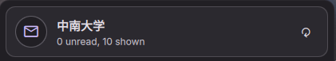

# Mail Reader for DankMaterialShell

An IMAP mail reader plugin for [DankMaterialShell](https://github.com/AvengeMedia/DankMaterialShell) with built-in email content viewer. Read your emails directly inside the shell without opening a separate mail client.

Forked from [Rocho's mailChecker](https://github.com/Rocho-EL-Locho/dms-mail-checker) with significant enhancements.



## Features

- **Bar indicator** with unread mail count
- **Popout message list** with sender, subject, and relative time
- **Built-in email content viewer** — click any message to read its full content (Subject, From, To, Date, Attachments, Body) directly inside the plugin
- **Server-side read status** — clicking a message marks it as read on the IMAP server with `\\Seen`
- **Attachment support** — attachments are saved to a temporary local directory and can be opened with `xdg-open`
- **Desktop notifications** for new mail (optional persistent mode keeps notifications on-screen until dismissed)
- **Configurable display count** — show all messages or only the latest N
- **Flexible polling** — auto-check every N seconds, or set to 0 for manual-only refresh
- **Safe listing** — message lists are fetched read-only with `BODY.PEEK` and never change mailbox state
- **Password via command** — use `secret-tool`, `pass`, or another secret manager instead of storing the password in plugin settings
- **Gmail OAuth2** — personal Gmail accounts can authorize via a browser without enabling two-step verification or creating an app password

## Dependencies

- `python3` (with `imaplib` — included in standard library)
- Gmail OAuth uses Python standard library only; no `secret-tool` or keyring required
- `notify-send` (usually provided by `libnotify`)
- `xdg-open` (usually provided by `xdg-utils`)
- A Wayland compositor supported by DMS (Hyprland, Niri, etc.)

## Installation

### Via DMS CLI

```bash
dms plugins install mailReader
```

### Manual

Clone this repository into your plugins folder:

```bash
cd ~/.config/DankMaterialShell/plugins
git clone https://github.com/YoungJurry/dms-mail-reader.git mailReader
```

Then restart DMS:

```bash
dms restart
```

## Configuration

Open DMS Settings → Plugins → Mail Reader and configure:

| Setting | Description |
|---------|-------------|
| Account Name | Display name (e.g. "Work", "Personal") |
| Authentication | Password command (default) or Gmail OAuth2 |
| Google OAuth Client ID | Google Desktop client ID for Gmail |
| IMAP Host | Your IMAP server hostname |
| IMAP Port | Default: 993 (SSL) or 143 (STARTTLS) |
| Connection Security | SSL/TLS or STARTTLS |
| Username | Your email address |
| Password Command | Shell command that prints the password |
| Folder | Mailbox folder (default: INBOX) |
| Display Mail Count | Number of messages to show. `0` = all, `x` = latest x |
| Check Interval | Auto-check interval in seconds. `0` = manual only (refresh on open) |
| Notifications | Enable/disable desktop notifications |
| Notify on Startup if Unread | Notify immediately on startup if there are unread emails from while the computer was off (enabled by default) |
| Persistent Notifications | Keep notifications on screen until manually closed (enabled by default) |

### Password Command Examples

Using `pass`:
```bash
pass show email/password
```

Using `secret-tool`:
```bash
secret-tool lookup service imap account you@example.com
```

Do not put an inline password in this field: plugin settings are stored on disk. Keep the secret in a credential manager and let the command retrieve it at runtime.

### Gmail OAuth2 (personal Gmail accounts)

**Yes, this requires the Gmail OAuth code in this version of the plugin.** Ordinary Gmail account passwords cannot be used as an IMAP `Password Command`; Google app passwords require two-step verification. OAuth does **not** require enabling two-step verification, though Google may ask you to confirm a sign-in. The plugin connects to Gmail with IMAP XOAUTH2; it does not use the Gmail API. You need your own Google OAuth client ID; there is no built-in shared Google app registration. The plugin uses the broad [`https://mail.google.com/` permission](https://developers.google.com/workspace/gmail/imap/xoauth2-protocol) mandated by Gmail IMAP, including access beyond reading. Only grant this to a client you trust. Personal Gmail accounts have IMAP enabled automatically; [there is no IMAP switch to turn on](https://support.google.com/mail/answer/7126229).

1. Sign in to [Google Cloud Console](https://console.cloud.google.com/) with the Gmail account. Create/select a project (you do **not** need an Azure subscription). Under **Google Auth Platform**, configure **Branding** (app name and contact email), **Audience → External**, and **Data Access** with `https://mail.google.com/`. If the app is in **Testing**, add your Gmail address under **Test users**. Under **Clients → Create client**, choose **Desktop app** (not Web application), and copy its **Client ID** (ends in `.apps.googleusercontent.com`). Download the **OAuth client JSON** from the Clients page; Google currently requires its Desktop `client_secret` at the token endpoint even with PKCE. Google may change the console screens; follow their [desktop OAuth guide](https://developers.google.com/identity/protocols/oauth2/native-app).
2. Configure DMS Settings → Plugins → Mail Reader:

   | Field | Value |
   | --- | --- |
   | Authentication | Gmail OAuth2 |
   | Account Name | Gmail (or any display name) |
   | Google OAuth Client ID | Your Google Desktop client ID |
   | IMAP Host | `imap.gmail.com` |
   | IMAP Port | `993` (or empty) |
   | Connection Security | SSL/TLS |
   | Username | Full Gmail address, e.g. `you@gmail.com` |
   | Password Command | Empty |
   | Folder | `INBOX` |

3. From **the installed plugin directory** run:

   ```bash
   python3 scripts/authorize-gmail.py --client-json '/path/to/downloaded-client.json' --username 'you@gmail.com'
   ```

   The script opens your browser (or prints a URL to open). Sign in with the **same** Gmail address and grant access. A temporary callback listens **only on `127.0.0.1`**; browser and script must be on the same machine. It checks Gmail IMAP access before saving the Desktop client secret and tokens under `~/.local/state/dms-mail-reader-gmail/` (or `$XDG_STATE_HOME/dms-mail-reader-gmail/`). That directory is owner-only (0700) and credential files are owner-only (0600) but **not encrypted at rest**. Protect your Linux login and backups. The Desktop app cannot keep a client secret truly confidential; it must not be hard-coded in the plugin or put in DMS settings. After successful authorization, you can delete the downloaded JSON. To reauthorize later, use `--client-id 'YOUR-ID.apps.googleusercontent.com'` instead of `--client-json` (the secret is already stored locally). Refresh the widget; if access is revoked, run this command again. Do not share tokens or authorization callback URLs. No Google password or token belongs in DMS settings.

**Important for persistent access:** Google's [Testing status expires authorizations and refresh tokens after 7 days](https://support.google.com/cloud/answer/15549945?hl=en) for Gmail scopes. For ongoing **personal use**, set **Audience → Publishing status → In production** after setup; Google [allows personal-use apps with fewer than 100 users without verification](https://support.google.com/cloud/answer/13464323?hl=en), but expect an **unverified app** warning and a 100-new-user cap. Do not publish this plugin as an OAuth integration for a general audience without checking Google's verification and restricted-scope policies. This version was not tested with a live Google account in CI.

## How It Works

- Uses Python's built-in `imaplib` to connect to your IMAP server; Gmail OAuth authenticates with SASL XOAUTH2 and refreshes tokens as needed
- Configuration is passed to the helper over stdin, so it does not appear in the helper's process arguments
- TLS certificates and hostnames are verified using the system CA store
- Listing messages is read-only and fetches visible headers in one batch
- Notification tracking uses IMAP `UIDVALIDITY` and the latest UID, independently of the display limit
- Opening a message fetches content with `BODY.PEEK[]`, then explicitly marks that message as read with `\\Seen`
- Messages larger than 50 MB are rejected before download to protect memory and temporary storage
- Attachments are stored in an owner-only runtime cache, removed after 24 hours, and opened via `xdg-open` when clicked
- The plugin polls for new mail at the configured interval, or manually when `Check Interval = 0`

## Development

Run the helper tests and QML syntax checks before submitting changes:

```bash
python3 -m unittest discover -s tests -v
qmllint MailReaderWidget.qml MailReaderPopout.qml MailReaderSettings.qml services/MailService.qml
```

## Acknowledgements

This plugin is forked from [mailChecker](https://github.com/Rocho-EL-Locho/dms-mail-checker) by [Rocho](https://github.com/Rocho-EL-Locho). The original plugin provides IMAP unread counting and desktop notifications. This fork adds:

- Built-in email content viewer (click to read full message)
- Mark-as-read behavior when opening messages
- Attachment extraction and opening via temporary files
- Configurable display count (0 = all, x = latest x)
- Manual-only refresh mode (Check Interval = 0)
- Removed mail client launch dependency

## License

MIT — see [LICENSE](LICENSE)
